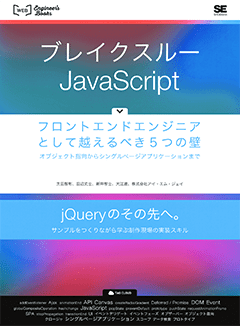

# javascript学習 (ブレイクスルーJavaScript)

## 書籍について
下記の書籍で学習したコードです。
- ブレイクスルーJavaScript ~フロントエンドエンジニアとして越えるべき5つの壁~  
https://www.shoeisha.co.jp/book/detail/9784798139050  
  
※ サンプルコードは、「翔泳社」からダウンロードしたものを格納しています

## **Chapter-01 01**
  - **prototypeプロパティについて**  
  ※ ./sample/Chapter1/chp01-01/01/index.html

  - **prototypeプロパティを使わないやり方について**  
  ※ ./sample/Chapter1/chp01-01/02/index.html

  - **prototypeプロパティを使ったメモリ節約**  
  ※ ./sample/Chapter1/chp01-01/03/index.html

## **Chapter-01 02**

  - **変数のスコープ（１）**  
  ※ ./sample/Chapter1/chp01-02/01/index.html

  - **変数のスコープ（２）**  
  ※ ./sample/Chapter1/chp01-02/02/index.html

  - **クロージャー（１）**  
  ※ ./sample/Chapter1/chp01-02/03/index.html

  - **クロージャー（２）**  
  ※ ./sample/Chapter1/chp01-02/04/index.html

  - **クロージャー（３）**  
  ※ ./sample/Chapter1/chp01-02/05/index.html

## **Chapter-01 03 - オブザーバーについて**

  - **オブザーバー（１）**  
  ※ ./sample/Chapter1/chp01-03/01/index.html

  - **オブザーバー（２）**  
  ※ ./sample/Chapter1/chp01-03/02/index.html

## **Chapter-01 04 - thisについて**

  - **thisについて**  
  ※ ./sample/Chapter1/chp01-04/01/index.html

  - **thisを操作する（call）**  
  ※ ./sample/Chapter1/chp01-04/02/index.html

  - **thisを操作する（apply）**  
  ※ ./sample/Chapter1/chp01-04/03/index.html

  - **thisを操作する（bind）**  
  ※ ./sample/Chapter1/chp01-04/04/index.html

## **Chapter-01 05 - リアルタイムバリデーション**

  - **フォームを作成する**  
  ※ ./sample/Chapter1/chp01-05/01/index.html

  - **バリデーションを実装する**  
  ※ ./sample/Chapter1/chp01-05/02/index.html

  - **ModelとViewを連携する**  
  ※ ./sample/Chapter1/chp01-05/03/index.html

  - **DOM Eventを登録する**  
  ※ ./sample/Chapter1/chp01-05/04/index.html

  - **onKeyupメソッドを実装する**  
  ※ ./sample/Chapter1/chp01-05/05/index.html

